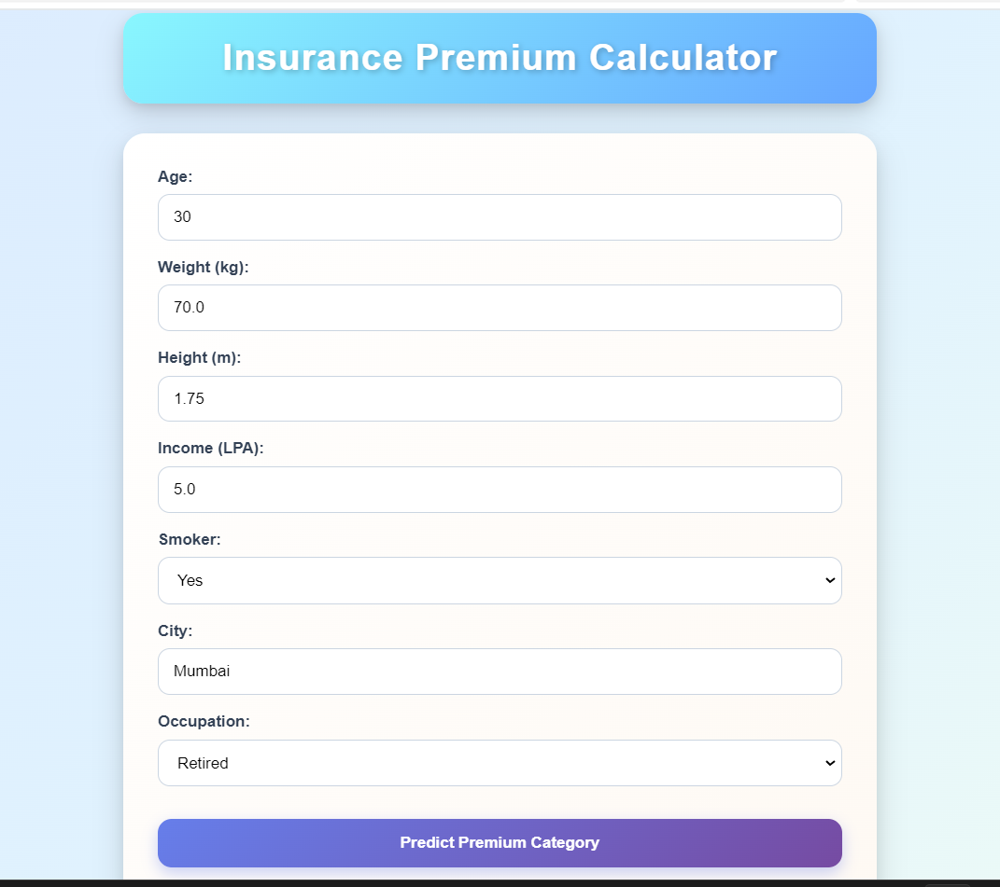
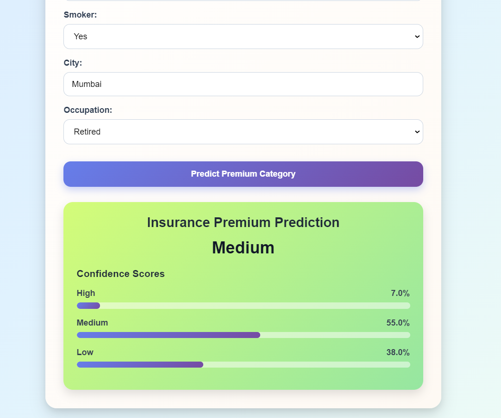

# 🛡️ Insurance Premium Prediction System


> A production-ready, full-stack machine learning web application that predicts insurance premium categories based on personal and lifestyle attributes — containerized with Docker and deployed on AWS EC2.

---

## 📌 Overview

Insurance premium pricing is complex and often opaque. This application brings transparency to that process by letting users input their personal details and instantly receive a predicted premium category — **Low**, **Medium**, or **High** — along with confidence scores for each class.

The system is built around a trained Scikit-learn classification model, served via a FastAPI REST API backend, and presented through a clean, responsive HTML/CSS/JS frontend. The entire stack is containerized using Docker and orchestrated with Docker Compose, making it portable and deployment-ready.

**Core Objective:** Bridge the gap between ML model inference and end-user accessibility through a clean API layer and an intuitive UI — while following industry-standard deployment practices.

---

## ✨ Features

- 🔮 **Real-time premium prediction** — classifies insurance risk into Low, Medium, or High categories
- 📊 **Confidence score visualization** — displays probability distribution across all prediction classes
- ⚡ **FastAPI backend** — async REST API with automatic Swagger documentation at `/docs`
- 🧪 **Pydantic input validation** — strict schema enforcement with field-level validators
- 🧠 **Smart feature engineering** — automatically computes BMI, age group, lifestyle risk, and city tier from raw inputs
- 🌐 **Vanilla JS frontend** — no framework dependencies, async fetch API, zero page reloads
- 🐳 **Fully Dockerized** — separate optimized images for backend and frontend
- 🔀 **Nginx reverse proxy** — routes `/api/*` requests from frontend to the FastAPI backend
- ☁️ **Cloud-deployed** — production deployment on AWS EC2 via Docker Compose

---

## 🧰 Tech Stack

### Backend
| Technology | Purpose |
|---|---|
| Python 3.12 | Core language |
| FastAPI | REST API framework |
| Uvicorn | ASGI server |
| Pydantic v2 | Input validation and schema |
| Joblib | Model serialization and loading |

### Frontend
| Technology | Purpose |
|---|---|
| HTML5 / CSS3 | Structure and styling |
| Vanilla JavaScript | Async form handling and API calls |
| Nginx (Alpine) | Static file serving and reverse proxy |

### Machine Learning
| Technology | Purpose |
|---|---|
| Scikit-learn | Model training and inference |
| Pandas | Data manipulation |
| NumPy | Numerical computation |
| Joblib | `.pkl` model persistence |

### DevOps & Deployment
| Technology | Purpose |
|---|---|
| Docker | Containerization |
| Docker Compose | Multi-container orchestration |
| Docker Hub | Image registry |
| AWS EC2 (Ubuntu 22.04) | Cloud deployment |

---

## 🏗️ Project Architecture

```
User Browser
     │
     ▼
┌─────────────────────────────┐
│   Nginx (Frontend Container) │  :80
│   Serves HTML/CSS/JS         │
│   Proxies /api/* → backend   │
└─────────────┬───────────────┘
              │ HTTP Proxy
              ▼
┌─────────────────────────────┐
│  FastAPI (Backend Container) │  :8000
│  Validates input (Pydantic)  │
│  Engineers features          │
│  Runs ML inference           │
│  Returns prediction + scores │
└─────────────┬───────────────┘
              │
              ▼
┌─────────────────────────────┐
│  Scikit-learn Model (.pkl)   │
│  Multi-class classifier      │
│  predict() + predict_proba() │
└─────────────────────────────┘
```

**Request Flow:**
1. User fills the form on the frontend and submits
2. JavaScript sends a `POST /api/predict` request
3. Nginx receives it and proxies to `http://backend:8000/predict`
4. FastAPI validates the payload using Pydantic
5. Computed fields (BMI, age group, lifestyle risk, city tier) are derived automatically
6. The ML model returns a predicted class and probability scores
7. Response is rendered on the frontend with a confidence breakdown

---

## 📁 Folder Structure

```
insurance-premium-api/
│
├── api.py                  # FastAPI app — routes, CORS, endpoints
├── main.py                 # Entry point placeholder
├── frontend.py             # Streamlit-based alternate UI (dev/testing)
├── requirements.txt        # Python dependencies
├── pyproject.toml          # Project metadata
│
├── model/
│   ├── insurance_premium_model.pkl   # Trained Scikit-learn classifier
│   ├── predict.py                    # Model loading and inference logic
│   └── model_training.ipynb          # Training notebook
│
├── schema/
│   └── input_validation.py   # Pydantic model with computed fields
│
├── utils/
│   └── city_tiers.py         # Tier 1 / Tier 2 city classification data
│
├── data/
│   └── insurance.csv         # Training dataset
│
├── template/
│   ├── index.html            # Frontend UI
│   ├── style.css             # Styling
│   └── script.js             # Async fetch logic
│
├── Dockerfile.backend        # Backend Docker image (multi-stage build)
├── Dockerfile.frontend       # Frontend Docker image (Nginx Alpine)
├── docker-compose.yml        # Orchestrates both containers
├── nginx.conf                # Nginx reverse proxy configuration
└── .dockerignore             # Build context exclusions
```

---

## ⚙️ Installation & Setup

### Prerequisites
- Python 3.12+
- Docker & Docker Compose
- Git

### 1. Clone the Repository

```bash
git clone https://github.com/adityaroy0804/insurance-premium-api.git
cd insurance-premium-api
```

### 2. Local Development (Without Docker)

```bash
# Create virtual environment
python -m venv .venv
source .venv/bin/activate        # On Windows: .venv\Scripts\activate

# Install dependencies
pip install -r requirements.txt

# Run the backend
uvicorn api:app --host 0.0.0.0 --port 8000 --reload
```

Open `http://localhost:8000/docs` for the interactive API documentation.

For the Streamlit UI (dev testing):
```bash
streamlit run frontend.py
```

### 3. Docker Setup (Recommended)

```bash
# Build images
docker build -f Dockerfile.backend  -t insurance-backend:latest .
docker build -f Dockerfile.frontend -t insurance-frontend:latest .

# Run with Docker Compose
docker compose up -d

# Check status
docker ps
```

- Frontend → `http://localhost`
- Backend API → `http://localhost:8000`
- Swagger Docs → `http://localhost:8000/docs`

---

## 📡 API Endpoints

| Method | Endpoint | Description |
|--------|----------|-------------|
| `GET` | `/` | Welcome message |
| `GET` | `/health` | Health check + model status |
| `POST` | `/predict` | Predict insurance premium category |

### POST `/predict` — Request Body

```json
{
  "age": 35,
  "weight": 78.5,
  "height": 1.75,
  "income_lpa": 8.0,
  "smoker": false,
  "city": "Pune",
  "occupation": "private_job"
}
```

### Response

```json
{
  "response": {
    "predicted_premium": "Medium",
    "confidence_scores": {
      "High": 0.18,
      "Medium": 0.67,
      "Low": 0.15
    }
  }
}
```

**Supported occupations:** `retired`, `freelancer`, `student`, `government_job`, `business_owner`, `unemployed`, `private_job`

---

## 🤖 Machine Learning Details

### Model Purpose
Multi-class classification to predict insurance premium tier: **Low**, **Medium**, or **High**.

### Input Features

| Feature | Type | Description |
|---|---|---|
| `age` | int | Age in years (1–119) |
| `weight` | float | Weight in kg |
| `height` | float | Height in metres |
| `income_lpa` | float | Annual income in lakhs |
| `smoker` | bool | Smoking status |
| `city` | str | City of residence |
| `occupation` | str | One of 7 occupation categories |

### Engineered Features (Auto-computed via Pydantic)

| Feature | Logic |
|---|---|
| `bmi` | `weight / height²` |
| `age_group` | young / adult / middle-aged / senior |
| `lifestyle_risk` | high / medium / low (based on BMI + smoker status) |
| `city_tier` | 1 (metro) / 2 (major city) / 3 (others) |

### Inference Pipeline
1. Raw input received via API → validated by Pydantic
2. Computed fields derived automatically as `@computed_field` properties
3. Full feature dict passed as a Pandas DataFrame to the model
4. `model.predict()` returns the premium class
5. `model.predict_proba()` returns confidence scores per class
6. Result returned as structured JSON

---

## 🖼️ Screenshots

> _Add screenshots of the frontend UI and prediction results here_

| Frontend Form | Prediction Result |
|---|---|
|  |  |


---

## 🚀 Deployment

### Docker Hub

Images are publicly available:
```bash
docker pull adityaroy0804/insurance-backend:latest
docker pull adityaroy0804/insurance-frontend:latest
```

### AWS EC2

```bash
# On EC2 (Ubuntu 22.04) — after Docker installation
mkdir ~/insurance-app && cd ~/insurance-app

# Create docker-compose.yml (see repo), then:
sudo docker compose pull
sudo docker compose up -d
```

App is live at `http://<EC2-Public-IP>`

---

## 🔭 Future Improvements

- [ ] Add user authentication (JWT-based login)
- [ ] Integrate a database (PostgreSQL) to log predictions
- [ ] CI/CD pipeline with GitHub Actions — auto build and push on every commit
- [ ] HTTPS support via Let's Encrypt + Certbot
- [ ] Add model versioning and A/B testing support
- [ ] Migrate to AWS ECS or Kubernetes for production-scale orchestration
- [ ] Replace free-tier Render deployment with a custom domain

---

## 📚 Learning Outcomes

Through this project, the following concepts were applied end-to-end:

- Building and serving ML models via REST APIs using **FastAPI**
- **Pydantic v2** for input validation including computed and derived fields
- **Multi-stage Docker builds** to produce lean production images
- **Nginx** as a reverse proxy for frontend-backend communication
- **Docker Compose** for multi-container orchestration with health checks
- **AWS EC2** provisioning, security groups, and cloud deployment
- **Docker Hub** as a container image registry

---

## 🤝 Contributing

Contributions are welcome! To get started:

```bash
# Fork the repo and clone your fork
git checkout -b feature/your-feature-name

# Make your changes, then
git commit -m "feat: describe your change"
git push origin feature/your-feature-name

# Open a Pull Request
```

Please keep PRs focused and include a clear description of what was changed and why.

---

## 📄 License

This project is licensed under the [MIT License](LICENSE).

---

## 👤 Author

**Aditya Kumar Roy**

B.Tech — AI & Data Science | Yeshwantrao Chavan College of Engineering, Nagpur

[](https://github.com/adityaroy0804)


> _Built as part of a hands-on learning project covering ML deployment, containerization, and cloud infrastructure._
